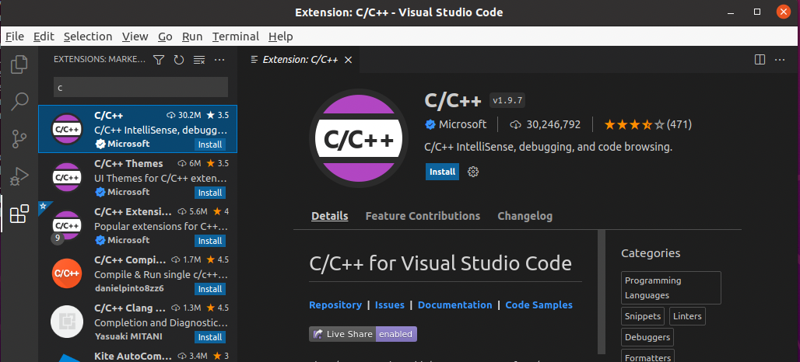

# stm32-linux-tutorial

# Installing the Prerequisites
## Installing the prerequisites for STM32
1. Update repositories and dependencies
   - `sudo apt update && sudo apt upgrade`
2. Install build essentials:
   - `sudo apt install! build-essential`
3. Install the Arm GNU Toolchain ([Link])
   - `sudo apt install gcc-arm-none-eabi`
4. Install the GNU Debugger (GDB)
   - `sudo apt install gdb-multiarch`
5. Install the ST-Link Utility
    - `sudo apt install stlink-tools`
6. Install OpenOCD (Open On-Chip Debugger)
   - `sudo apt install openocd`

## Install STM32CubeMX
STM32CubeMX is used for initial code initialization and the Makefile generation.
1. Download STM32CubeMX from [here](https://www.st.com/en/development-tools/stm32cubemx.html)
   - You will need to enter your email to access the download link.
2. Unzip the zip file, currently the file is `en.stm32cubemx-lin_v6-5-0_v6.5.0.zip`
   - `unzip en.stm32cubemx-lin_v6-5-0_v6.5.0.zip`
3. Change the permissions of the `SetupSTM32CubeMX-6.5.0` file to be able to execute
   - `chmod +x SetupSTM32CubeMX-6.5.0`
4. Start the installer
   - `./SetupSTM32CubeMX-6.5.0`
    
   - Next > Accept the terms and agreements and click next > Accept Privacy Policy and click Next > Note the installation path and click Next > Click OK
5. Once the installer is finished, navigate to the directory created in Step 4 (`~/STM32CubeMX/`) and click the `STM32CubeMX` application to start it
    

## Installing Visual Studio Code and Plugins
1. Install Visual Studio Code
   - `sudo snap install --classic code`
    - If your distribution does not include Snap, the download links and steps for other distributions can be found [here](https://code.visualstudio.com/docs/setup/linux).
2. Install the C/C++ plugin for VS code
   1. Type `Control + Shift + P` and then select `Install Extensions`
   
   2. Search for `C/C++` and install it
   
   3. Search for `cortex debug` and install it
   

# Generating Code with STM32CubeMX
Once all of the pre-requisites are installed and ready to go, we can create a project with STM32CubeMX.
1. Open `STM32CubeMX`
  
2. Start a new project and name it `blink`
   1. File > New Project
   2. Select the `Board Selector` Tab and find the `Nucleo-WB55RG` board and double click on the row with the correct board.
    
   3. Initialize all peripherals with their Default Mode
3. Navigate to the `Project Manager` tab
   1. Change the name to `blink`
   2. Select `Browse` under Project Location and create a directory for the `blink project`
   3. Change the Toolchain/IDE to `Makefile`
   
4. Navigate to the `Code Generator` tab on the left while under the `Project Manager` tab
   1. Under the `Generated files` section, check all four boxes
   
5. Click `Generate Code` in the top right
   1. Click `Yes` to download all the needed dependencies
   2. Agree to the license terms and agreements and click `Finish`

# Building the project in Visual Studio Code
1. Navigate to the project directory
2. Once inside the project directory, run `code .` and VS Code will open the project folder
   
3. Open the `Makefile` and notate the entries in the `C_DEFS` variable. Remove the `-D before the entries`.
   1. Mine were `USE_HAL_DRIVER` and `STM32WB55xx`
      
4. Open the C/C++ Configuration and add the defines mentioned above
   1. Open the naviation with `Control + Shift + p`
   2. Type `edit config`
   3. Select `C/C++: Edit Configurations (JSON)`
   
   4. In the `defines` section, add the entries from Step 3.
   
   5. Intellisense is now functioning correctly!

5. Edit the `Makefile` to include a step to flash the binary to the physical device
   1. Add `flash: st-flash write $(BUILD_DIR)/$(TARGET).bin 0x8000000` to the end of the `Makefile`
6. Now that the `Makefile` is correct, let's compile the project and flash it to the board
   1. Open a Terminal in VS Code with `` Control + Shift + ` ``